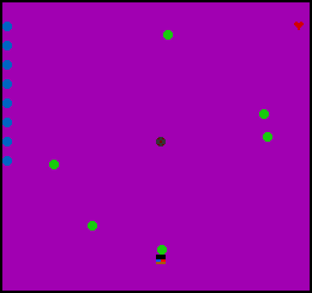
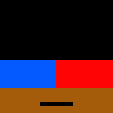

# Time-Stop Juggler

Author: Rakshit Tikoo

Design: The game is based on mobile game knife hit. The player needs to juggle 10 balls in each level. The different thing from the original game is that we have a time-freeze
    power up which slows down the game, and helps you play longer. 

Screen Shot:

How Your Asset Pipeline Works:

The asset pipeline code is the script - [link](convert_png_2_code.py) 
This code uses the python opencv module to read the png image files. We just need to specify the path to the asset directory and it reads all the png files in that directory.The opencv module returns a 128x128 pixel image. The code compresses it to an 8x8 pixel value, quantizes it to 4 colors, and then converts the pixel info in a PPU466 readable format. The script then generates cpp code and stores it into a temp txt file (output_code.txt), which it then reads to update the PlayMode.cpp file. If the PlayMode constructor has no code, then it just adds the asset info there. If there is some code which we want to retain, we need to add the comment "//Insert Code Below" in the constructor, and then it will not overwrite any code above the comment. The comment gets added automatically if its not present initially. 

All the assets can be found in this directory - [link](Assets/)

The following assets are there - 

 This gives the background color.

 This is the sprite for the main playable balls. 

 This is the sprite for the bombs. 

 This is the sprite for the time-freeze power up.

 This is the sprite for the extra-life power up. 

 This is the sprite for the player. 

How To Play:

The goal of the game is to juggle 10 balls in each level, and reach a level as high as possible. The balls are juggled in a ring, and they appear at the center of the ring. The player is at the bottom edge of the circle, and the balls are dropped on them. You must make sure you do not drop a ball, when another ball, currently being juggled, is in the hands of the player (i.e. there is no ball directly below the next ball). If you do that, you lose. After successfully juggling 10 balls, the level increases, which resets the balls and increases the speed of the game, thus making further leveling up more challenging. 

To make sure you do not spam dropping balls, at the center of the ring, bombs can also appear randomly. If you drop the bomb, you lose. To clear the bombs, you need to swat them away using a different key press (all buttons are explained below). 

There is a time-freeze ability available to you, which slows down the game (halves the current level speed), which can help you play longer. The amount of ability left can be seen from the time-freeze bar on the left of the screen. Once consumed, it regenerates slowly over time. 

There are two power ups available as well, which would also appear at the center of the ring. One is the time-freeze refill which refills your time-freeze ability (it looks the same as the time-freeze bar) and another is an extra life (a heart symbol). You can at max have 1 extra life, which when available can be seen as a heart symbol on top right of the screen. 

Controls:

Spacebar - To drop balls and power ups

S key - To swat bombs away

F key - To enable time freeze

This game was built with [NEST](NEST.md).

